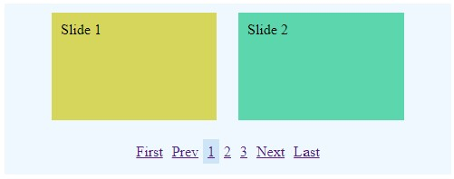

# PurePajinate

A pure javascript class for paginating through any number of DOM elements.<br>
Inspired by [Pajinate](https://github.com/wesnolte/Pajinate), a plugin for jQuery.

<span style="display:block;text-align:center"></span>

## Options

| Option | Type | Description |
| --- | --- | --- |
| `containerSelector` | String | Default: `'.items'`. <br> The items' container selector. |
| `itemSelector` | String | Default: `'.item'`. <br> The individual item's selector. |
| `navigationSelector` | String | Default: `'.page_navigation'`. <br> The pagination container selector. |
| `itemsPerPage` | integer | Default: `10`. <br> The number of items that will show at once. |
| `pageLinksToDisplay` | integer | Default: `10`. <br> The number of page links to display at once. All other pages will be hidden and replaced with ... |
| `startPage` | integer | Default: `0`. <br> The first page to show. To show page 3, the value will be 2 |
| `wrapAround` | Boolean | Default: `false`. <br> Determine if the pages should loop or not. |
| `navLabelFirst` | String | Default: `'First'`. <br> The label for the first control. |
| `navLabelPrev` | String | Default: `'Prev'`. <br> The label for the previous control. |
| `navLabelNext` | String | Default: `'Next'`. <br> The label for the next control. |
| `navLabelLast` | String | Default: `'Last'`. <br> The label for the last control. |
| `navAriaLabelFirst` | String | Default: `'First'`. <br> The aria label for the first control. |
| `navAriaLabelPrev` | String | Default: `'Prev'`. <br> The aria label for the previous control. |
| `navAriaLabelNext` | String | Default: `'Next'`. <br> The aria label for the next control. |
| `navAriaLabelLast` | String | Default: `'Last'`. <br> The aria label for the last control. |
| `navOrder` | Array | Default: `["first", "prev", "num", "next", "last"]`. <br> The order of the controls. 'num' represents the page links. |
| `showFirstLast` | Boolean | Default: `false`. <br> Determine if the first and last controls will show or not. |
| `showPrevNext` | Boolean | Default: `true`. <br> Determine if the previous and next controls will show or not. |
| `hideOnSmall` | Boolean | Default: `false`. <br> Determine if the pagination shows when the number of items is smaller than the number of items per page. |
| `defaultClass` | String | Default: `''`. <br> A class to apply to all control elements. |
| `activeClass` | String | Default: `'active'`. <br> A class to apply to the active page link. |
| `disabledClass` | String | Default: `'disabled'`. <br> A class to apply to disabled controls. |
| `onInit` | Function | Default: false. <br> Callback to be run on initialization. |
| `onPageDisplayed` | Function | Default: false. <br> Callback to be run once a page is displayed. |

## Usage

Wrap your items (`div`, `a`, `img`, `span`, `li`, ...) within a container element (`div`, `ul`, ...).

```html
<div class="items">
  <div class="item"> Your Content </div>
  <div class="item"> Your Content </div>
  <div class="item"> Your Content </div>
  <div class="item"> Your Content </div>
  <div class="item"> Your Content </div>
  <div class="item"> Your Content </div>
  <div class="item"> Your Content </div>
</div>
<div class="page_navigation"></div>
```

Call the class once the DOM is ready.

```javascript
document.addEventListener('DOMContentLoaded', function() {
  var my_example = new purePajinate({ itemsPerPage: 2 });
});
```

The CSS class `loaded` is added to the container once the pagination has finished initializing.  

## Browser Support

When using the Ecmascript 5 version, supports goes all the way back to Internet Explorer 10.
I have used [Babel](https://babeljs.io/) to convert the code into Ecmascript 5 compatible code.

## License

GNU General Public License version 3 or later. <br>
See [License details](https://www.gnu.org/licenses/gpl-3.0.en.html)

